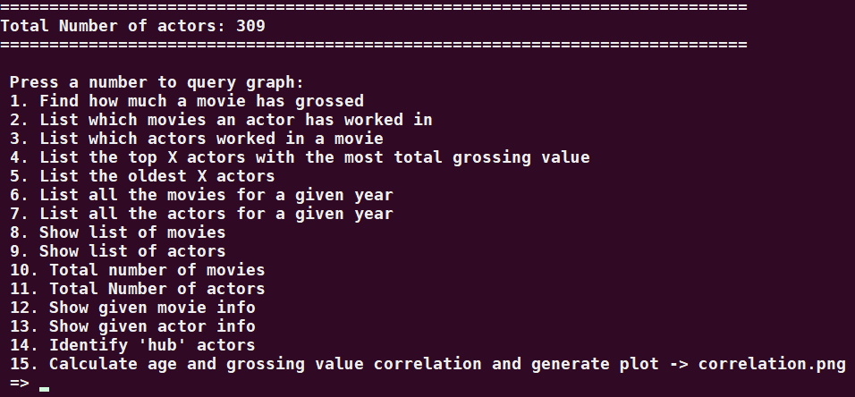
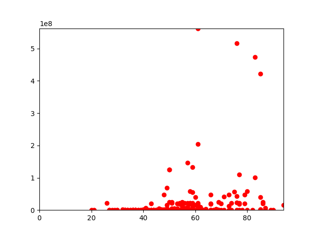
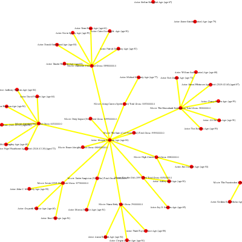
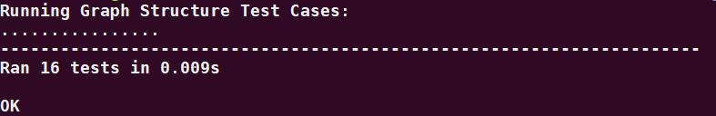
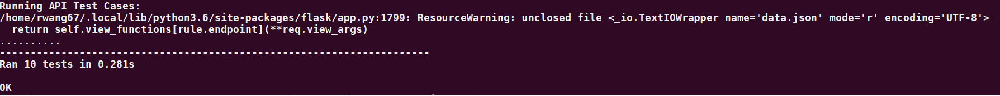

# fa18-cs242-assignment2
# To install
###### It is recommanded to create a virtual environment first: 
* To create virenv:
    ```bash
    virtualenv venv
    source venv/bin/activate
    ```
* Then install requirement:
    ```bash
    pip3 install -r requirements.txt
    ```

# To Run:
###### There are 3 options:
1. Run scraper to generate JSON
    ```python
    python3 main.py scrap
    ```
2. Use cached JSON to generate graph and query graph
    ```python
    python3 main.py cache
    ```
3. Use provided JSON to generate graph and query graph
    ```python
    python3 main.py input
    ```

###### Graph Query:
* Based on the prompt message, enter valid input

* For example:
     1. Find how much a "The Boy Next Door (film)" has grossed:
        ```bash
        => 1 The Boy Next Door (film)
        ```
     2. List which movies an "Morgan Freeman" has worked in:
        ```bash
        => 2 Morgan Freeman
        ```
     3. List which actors worked in movie "Dreamcatcher (2003 film)":
        ```bash
        => 3 Dreamcatcher (2003 film)
        ```
     4. List the top 50 actors with the most total grossing value
        ```bash
        => 4 50
        ```
     5. List the oldest 20 actors
        ```bash
        => 5 20
        ```
     6. List all the movies in year 2018:
        ```bash
        => 6 2018
        ```
     7. List all the actors in year 2016:
        ```bash
        => 7 2016
        ```
     8. Show list of movies:
        ```bash
        => 8
        ```
     9. Show list of actors:
        ```bash
        => 9
        ```
     9. Total number of movies:
        ```bash
        => 10
        ```
     9. Total Number of actors:
        ```bash
        => 11
        ```
     9. Show given movie info:
        ```bash
        => 12 The Verdict
        ```
     9. Show given actor info:
        ```bash
        => 13 Bruce Willis
        ```
     9. Identify 'hub' actors:
        ```bash
        => 14
        ```
     9. Calculate age and grossing value correlation and generate plot -> correlation.png:
        ```bash
        => 15
        ```
        * The correlation graph looks like the following:

        * You can also visualize the graph structrue by rendering the graph_cache.svg on a browser, the graph looks like the following:


# To Confige:
* Modify parameters in config.py
```bash
CLOSESPIDER_ITEMCOUNT = 30
wiki_start = "https://en.wikipedia.org/wiki/Morgan_Freeman"
PORT = 5001
```
# To test:
### Test Graph Structure
```python
python3 graphy_test.py
```
* There are total of 16 test cases to run, correct output looks like the following:


# To Run API:
```python
python3 app.py
```

### Test API
```python
python3 test_app.py
```
* To run the API test_app.py, first start running the serve:
```python
python3 app.py
```
* There are total of 10 test cases to run, correct output looks like the following:


